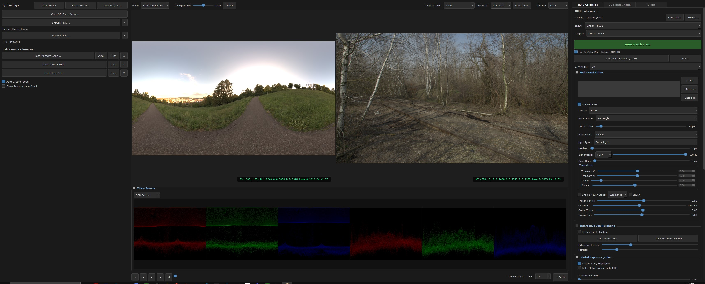

<h1 align="center">HDRI Match Plate</h1>

  <strong>A Professional VFX Pipeline Tool for HDRI Calibration, CG Lookdev, and Generative Inpainting.</strong>

  
   
  <em>Click the image above to read the full PDF Tutorial & Workflow Guide.</em>

---

**HDRI Match Plate** is an advanced, production-ready utility designed for Lighting TDs, Compositors, and VFX Artists. It provides a highly interactive, physical workspace for seamlessly matching 360° environment HDRIs and multi-pass CG renders to live-action camera plates.

With built-in native integration for Foundry Nuke (Docked Panel & Live-Link), as well as a fully compiled Standalone application, it effortlessly bridges the gap between on-set data wrangling, 3D Lookdev, and final compositing.

## ✨ Key Features

- 📸 **Physically Accurate Calibration:** Extract and apply EV exposures, White Balance, and Color space transforms (ACEScg compliant) to physically match HDRIs to reference plates.
- 🎨 **Macbeth Chart Auto-Detection:** Automatically detect and crop X-Rite ColorCheckers from the plate to instantly solve for complex temperature/tint shifts.
- 💡 **Interactive CG Lookdev Match:** Load multi-channel linear EXRs from any modern path-tracer (Arnold, V-Ray, Karma). Isolate light groups, tweak EV/Temp/Tint, and pre-comp shadow catchers natively against the plate.
- 🧠 **Generative AI HDRI Inpainting:** Erase tripods, camera operators, and lighting rigs from 360 HDRIs using local, un-censored ComfyUI GenAI pipelines (Stable Diffusion/Flux) with full Spherical Projection awareness.
- 🔄 **Nuke Live-Link Integration:** Export your entire calibration setup directly to the Nuke Node Graph with a single click. Manipulate UI sliders and watch the Nuke composite update in real-time.
- 🎞️ **Sequence Animation Rendering:** Full timeline support for scrubbing moving plates and tracking dynamic lighting changes over time.

## 🚀 Installation

HDRI Match Plate can be deployed in two main ways depending on your studio workflow:

### 1. Nuke Docked Panel (Recommended)
Integrates the tool directly into Foundry Nuke as a native PySide widget.
* Use the included **`Install_Nuke_Windows.bat`** or **`Install_Nuke_Linux_Mac.sh`** scripts to automatically configure your `~/.nuke` directory and `menu.py`.
* Alternatively, manually copy the `hdri_match` package into your `~/.nuke` directory and register the panel in your `menu.py`.

### 2. Standalone Executable
A fully independent, pre-compiled Windows `.exe` application requiring **no Python installation or DCCs**.
* Ideal for on-set data wranglers or lighting artists.
* Simply extract the `HDRI_Match_Plate_Standalone` directory and run the executable.

### 3. Houdini Solaris Import Shelf
A custom shelf tool is included to automatically ingest calibrated HDRIs and generated USD light metadata into Houdini.
* Open Houdini and right-click an empty space on any Shelf -> **New Tool**.
* Name it **HDRI Match Plate Import**.
* Under the **Script** tab, copy and paste the entire contents of the `Houdini_Shelf_Tool.py` file included in this repository.
* Click **Apply**. You can now click this shelf button to auto-generate Python LOPs from your exports!

## 🛠️ Technical Details

* **Language:** Python 3.10+
* **UI Framework:** PySide6 (Standalone) / PySide2 & PySide6 (Nuke)
* **Color Science:** Custom `colour-science` and `OpenImageIO` pipelines. Linear ACEScg working space.
* **GenAI Engine:** Bridge integration for ComfyUI backend processing.

---

📖 *For a complete breakdown of every parameter and workflow, please click the screenshot at the top of the page to read the included `HDRI_Match_Plate_Tutorial.pdf`.*
